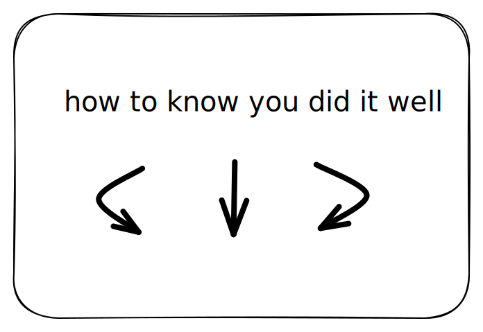

# How to Setup a Bank Account in Quickbooks


Below you'll find a step by step guide to linking your bank accounts to Quickbooks


Linking Your Bank Accounts to Quickbooks

1. &#x20;Sign in to QuickBooks Online:
   * [ ] Go to the QuickBooks Online website ([https://quickbooks.intuit.com/](https://quickbooks.intuit.com/)).
   * [ ] Sign in with your QuickBooks Online credentials.

<!---->

2. Access Banking Center:
   * [ ] Once you're logged in, click on the "Banking" or "Banking Center" option. This is typically located on the left-hand menu.

<!---->

3. Connect Your Bank Account:
   * [ ] In the Banking Center, you'll see an option to connect a bank account or credit card. Click on it.

<!---->

4. Search for Your Bank:
   * [ ] Use the search bar to look for your bank by name. QuickBooks Online has a large database of banks and financial institutions.

<!---->

5. Enter Your Bank Credentials:
   * [ ] After selecting your bank, you'll be prompted to enter your online banking credentials (username and password). This step is necessary to establish a secure connection between QuickBooks Online and your bank.

<!---->

6. Security Verification:
   * [ ] Depending on your bank's security procedures, you may need to go through additional verification steps, such as answering security questions or receiving a verification code via email or text message.

<!---->

7. Account Selection:
   * [ ] QuickBooks Online will retrieve a list of your bank accounts and credit cards associated with that bank.
   * [ ] Select the accounts you want to link to QuickBooks.
   * [ ] Make sure to match them to the correct accounts in QuickBooks.

<!---->

8. Link Accounts:
   * [ ] Click on the "Link Accounts" or "Connect" button to establish the connection. QuickBooks Online will start syncing your transactions.

<table data-header-hidden data-full-width="true"><thead><tr><th></th><th></th><th></th></tr></thead><tbody><tr><td>
<mark style="color:green;"><strong>Bank Account List:</strong></mark> 

After linking your bank accounts, you should see a list of your connected accounts in the Banking Center or the Chart of Accounts in QuickBooks Online. These accounts should be labeled with the correct account types (e.g., checking, savings, credit card).
</td><td>
<mark style="color:green;"><strong>Transaction Data:</strong></mark> 

QuickBooks Online should start importing your recent transactions from the linked bank accounts. These transactions will typically appear in the Banking Center or Transaction list. Ensure that the transactions match your actual financial activity.
</td><td>
<mark style="color:green;"><strong>Bank Balance:</strong></mark> 

The bank balance displayed in QuickBooks Online should match the actual balance of your bank accounts. You can check this in the Banking Center or by viewing the account details in the Chart of Accounts.
</td></tr><tr><td>
<mark style="background-color:green;"><strong>Last Sync Date:</strong></mark>

You can also check the last sync date to confirm that your transactions are up to date. QuickBooks Online usually displays the date and time of the last successful sync with your bank.
</td><td>
<mark style="background-color:green;"><strong>Transaction Categories:</strong></mark> 

As transactions are imported, they should be categorized correctly. QuickBooks Online uses algorithms to suggest categories, but you should review and adjust them as needed to ensure accurate bookkeeping.
</td><td>
<a data-footnote-ref href="#user-content-fn-1"><mark style="background-color:green;"><strong>Reconciliation:</strong></mark> </a>

If you use the bank reconciliation feature in QuickBooks Online, you should be able to reconcile your bank accounts with your bank statements. This process helps ensure that your records match your bank's records.
</td></tr><tr><td>
<strong>Automatic Updates:</strong>

QuickBooks Online should continue to automatically update your transactions regularly, so you don't have to manually input them. Check that new transactions are being imported as they occur.
</td><td>
<strong>Bank Balance Reconciliation:</strong>

Periodically, perform bank reconciliations to ensure that your QuickBooks Online records match your bank statements. This is a critical step in verifying the accuracy of your financial data.
</td><td>
<strong>No Error Messages:</strong> 

After linking your accounts, check for any error messages or notifications. Error messages may indicate issues with the connection that need to be resolved.
</td></tr><tr><td> </td><td>
<strong>Bank Feed Status:</strong>

QuickBooks Online often provides a bank feed status or connection status for each linked account. It will usually indicate whether the connection is active and if there are any issues with syncing data. Ensure that the status is "Connected" or "Active.”
</td><td> </td></tr></tbody></table>

## Positive Downstream Effects

Setting up your bank accounts and financial records correctly in QuickBooks Online can have several positive downstream effects for your business. These effects contribute to better financial management, decision-making, and overall operational efficiency. Here are some of the positive downstream effects:

| Accurate Financial Statements: When your bank accounts are correctly linked and transactions are categorized accurately, your financial statements, including the balance sheet and income statement, will reflect your true financial position. This accuracy is vital for making informed business decisions.     | 
Streamlined Bookkeeping: Automating the import of bank transactions and categorization reduces the manual effort required for bookkeeping. This saves time and reduces the risk of data entry errors, making your financial records more reliable.

  
             | 
Real-Time Data: With bank feeds and automatic updates, you have access to real-time financial data. This enables you to make timely decisions based on up-to-date information rather than relying on outdated records.

  
      |
| ------------------------------------------------------------------------------------------------------------------------------------------------------------------------------------------------------------------------------------------------------------------------------------------------------------------- | ------------------------------------------------------------------------------------------------------------------------------------------------------------------------------------------------------------------------------------------------------------------------------------ | ------------------------------------------------------------------------------------------------------------------------------------------------------------------------------------------------------------------------------------------------- |
| Improved Budgeting and Forecasting: Accurate financial data allows for better budgeting and forecasting. You can create more realistic budgets and financial projections, helping you plan for future expenses, revenue, and growth.                                                                                | Efficient Tax Preparation: Properly categorized transactions make tax preparation more straightforward and accurate. You can easily generate tax reports and export data for your accountant or tax professional during tax season.                                                  | Faster Reconciliation: Bank reconciliation becomes faster and more accurate when your records match your bank statements. This reduces the time and effort needed to ensure that your books are in sync with your actual financial activity.      |
| Better Cash Flow Management: By having an accurate picture of your cash flow in QuickBooks Online, you can better manage your business's cash needs. This includes ensuring you have enough cash on hand to cover expenses and investments.                                                                         | Financial Analysis: With clean and accurate financial data, you can perform meaningful financial analysis. This might include assessing the profitability of different products or services, identifying cost-saving opportunities, and evaluating your business's financial health. | Compliance and Auditing: Accurate financial records are essential for compliance with regulatory requirements and for potential audits. Properly documented transactions and financial statements can help your business remain in good standing. |
| Creditworthiness: If you ever need to apply for loans or seek external financing, having well-maintained financial records can enhance your business's creditworthiness. Lenders and investors often review financial statements to assess risk.                                                                    | Reduced Stress: Accurate and organized financial records reduce the stress associated with financial management. You'll have peace of mind knowing that your financial data is in order, making it easier to focus on other aspects of your business.                                | Business Growth: As your business grows, having a solid financial foundation becomes increasingly important. Properly set up financial records in QuickBooks Online can scale with your business, accommodating your needs as you expand.         |
| In summary, setting up and maintaining your financial records correctly in QuickBooks Online can lead to increased financial transparency, efficiency, and reliability. These benefits not only facilitate better decision-making but also contribute to the long-term success and sustainability of your business. |                                                                                                                                                                                                                                                                                      |                                                                                                                                                                                                                                                   |

## What to look for if you suspect you Linked Your Bank Accounts UnSuccessfully

If you suspect that you have not successfully linked your bank accounts to QuickBooks Online, there are several signs and issues to look for. An unsuccessful link can lead to discrepancies in your financial records and hinder your ability to manage your finances effectively. Here are some indicators that your bank accounts may not be linked successfully:

| No Transactions Imported: One of the most obvious signs is the absence of imported transactions in QuickBooks Online. If you don't see any recent transactions from your bank accounts, it's likely that the link was unsuccessful.                | 
Error Messages: Look for error messages or notifications within QuickBooks Online. These messages often provide information about what went wrong during the linking process. Common error messages may include incorrect login credentials, connection issues, or bank-specific errors.

 
 | 
Disconnected Status: Check the status of your bank account connections in the Banking Center. If the status is "Disconnected" or "Inactive," it indicates a problem with the connection.

 
                 |
| -------------------------------------------------------------------------------------------------------------------------------------------------------------------------------------------------------------------------------------------------- | ---------------------------------------------------------------------------------------------------------------------------------------------------------------------------------------------------------------------------------------------------------------------------------------------------------- | -------------------------------------------------------------------------------------------------------------------------------------------------------------------------------------------------------------------------- |
| 
Incorrect Balances: If the bank balance displayed in QuickBooks Online does not match the actual balance of your bank account, it's a clear sign of an issue. Ensure that the balances align to confirm a successful connection.

 
 | 
Duplicate Transactions: Sometimes, an unsuccessful link may result in duplicate transactions being imported into QuickBooks Online. If you see the same transactions imported multiple times, it's a sign of a problem.

 
                                                                  | 
Inability to Sync: If you're unable to manually trigger a synchronization or the automatic sync is not functioning as expected, this suggests that the link may not be set up correctly.

 
                 |
| 
Mismatched Categories: If transactions are imported but not categorized correctly, it can indicate that the link didn't capture the data accurately. Check for misclassified transactions in your bank feeds.

 
                    | 
Unusual or Missing Transactions: Look for any unusual or missing transactions. Transactions may be missing or incomplete if the link is not working as intended.

 
                                                                                                                         | Bank Authentication Issues: If you encounter difficulties in providing the correct bank credentials, such as repeated requests for verification or login failures, it can prevent the successful linking of your accounts. |
| Bank Policy Restrictions: Some banks have policies that restrict third-party access, and this can affect the linking process. Check with your bank to ensure they support the use of financial management software like QuickBooks Online.         | Slow or No Response: If the connection to your bank is slow or unresponsive, it may indicate problems with the bank's servers or network issues.                                                                                                                                                           | 
 
                                                                                                                                                                                                                |

## Negative Downstream Effects

Setting up your bank accounts and financial records correctly in QuickBooks Online should generally lead to positive outcomes as it helps improve financial accuracy and efficiency.&#x20;

However, it's essential to note that there are no inherent negative downstream effects of setting things up correctly in QuickBooks Online.

Instead, the potential negative outcomes typically arise from errors, mismanagement, or misconfigurations in your financial setup. Here are some potential negative effects if things are not set up correctly:

| Inaccurate Financial Statements: If you make mistakes in data entry or categorization, your financial statements can become inaccurate. This can lead to incorrect financial analysis, budgeting, and decision-making. | Cash Flow Problems: Failing to record income or expenses accurately can result in cash flow problems. You might not have enough cash on hand to cover your obligations, leading to financial strain.                | Tax Compliance Issues: Incorrectly categorized transactions can lead to tax compliance problems. You may underreport income or overstate expenses, potentially triggering audits or penalties.           |
| ---------------------------------------------------------------------------------------------------------------------------------------------------------------------------------------------------------------------- | ------------------------------------------------------------------------------------------------------------------------------------------------------------------------------------------------------------------- | -------------------------------------------------------------------------------------------------------------------------------------------------------------------------------------------------------- |
| Inefficient Bookkeeping: If your accounts and transactions are not set up correctly, it can lead to inefficient bookkeeping processes. You may spend more time reconciling accounts or fixing errors.                  | Decision-Making Errors: Inaccurate financial data can lead to poor decision-making. You might invest in projects or make financial commitments based on incorrect information.                                      | Reporting Errors: Incorrectly set up accounts can result in reporting errors. This can lead to difficulties in obtaining accurate financial reports and sharing financial information with stakeholders. |
| Audit Risks: If your financial records are not set up correctly and do not accurately reflect your financial activity, it can increase the risk of audit or scrutiny by tax authorities.                               | Loss of Credibility: Inaccurate financial records can damage your business's credibility, especially when dealing with investors, lenders, or partners who rely on accurate financial data.                         | Legal Consequences: Serious financial mismanagement can lead to legal consequences, including lawsuits or regulatory penalties, especially if it involves intentional fraud or misrepresentation.        |
| Operational Inefficiencies: Poorly managed financial records can result in operational inefficiencies, as you may struggle to track expenses, income, and other financial data.                                        | Wasted Time and Resources: Fixing errors in your financial records can be time-consuming and may require additional resources. This time and effort could have been better spent on other aspects of your business. | Missed Opportunities: If your financial data is not up to date and accurate, you might miss opportunities for growth, cost-saving, or investment                                                         |

To avoid these negative consequences, it's crucial to invest time and effort in setting up your financial records correctly in QuickBooks Online. This includes regularly reviewing and reconciling your accounts, categorizing transactions accurately, and seeking professional guidance when needed. Additionally, staying informed about accounting and tax regulations relevant to your business can help you maintain compliance and minimize risks.

**If you encounter any of these issues or suspect that your bank accounts are not linked successfully, here's what you can do:**

1. Check Bank Information: Verify that you have entered your bank's login credentials correctly, including your username and password. Ensure that your bank allows third-party access.
2. Review Bank Policies: Check with your bank to understand if there are any specific policies or restrictions regarding third-party access and data sharing.
3. Contact Customer Support: If you are unable to resolve the issue on your own, contact QuickBooks Online customer support or your bank's support for assistance. They can help troubleshoot the problem and provide guidance on how to link your accounts successfully.
4. Update QuickBooks Online: Ensure that your QuickBooks Online software is up to date. Sometimes, updates may include bug fixes and improvements related to bank account linking.
5. Reattempt the Linking Process: If an issue was encountered during the initial setup, consider reattempting the linking process to see if the problem is resolved.
6. Remember that it's crucial to address any linking issues promptly to maintain accurate financial records and ensure the smooth operation of your financial management in QuickBooks Online.

\

[^1]: 
