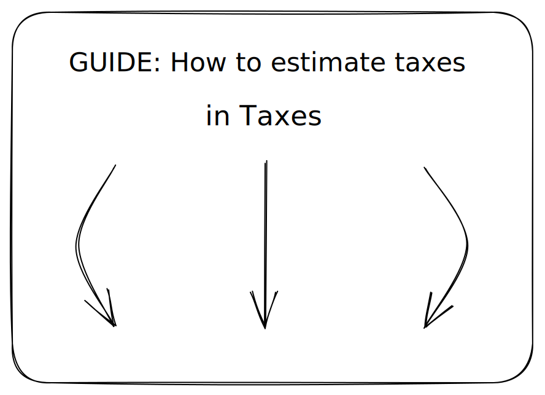

# Tax Estimates

## How to estimate Taxes in QuickBooks

Estimating income taxes and calculating sales tax using QuickBooks involves different processes. Here are the steps for each:

**How to Estimate Income Taxes:**

1. Access the Tax Center:
   * [ ] Log in to your QuickBooks Online account.
   * [ ] Navigate to the "Taxes" or "Tax Center" section. The location may vary slightly depending on your QuickBooks version.
2. Set Up Your Tax Profile:
   * [ ] If you haven't already, set up your tax profile by providing essential details about your business, including your legal structure (e.g., sole proprietorship, LLC, corporation), industry, and tax ID number.
3. Review Your Financial Data:
   * [ ] Ensure that your financial data in QuickBooks is up-to-date and accurate. This includes income, expenses, deductions, and credits.
4. Choose a Tax Year:
   * [ ] Specify the tax year for which you want to estimate income taxes. Common tax years are calendar years (January 1 to December 31) or fiscal years (custom periods chosen by your business).
5. Run a Tax Report:
   * [ ] Use the tax reporting feature in QuickBooks to generate a tax report for the chosen tax year. This report should provide an overview of your taxable income, deductions, and credits.
6. Calculate Estimated Tax Liability:
   * [ ] Review the tax report to calculate your estimated tax liability. This amount represents how much you expect to owe in income taxes for the specified tax year.
7. Consider Deductions and Credits:
   * [ ] Factor in any applicable tax deductions and credits to reduce your estimated tax liability. QuickBooks may offer guidance on available deductions and credits based on your business profile.

**Calculate Sales Tax:**

1. Set Up Sales Tax Settings:
   * [ ] In QuickBooks Online, navigate to the "Taxes" or "Sales Tax" section.
   * [ ] Configure your sales tax settings, including your sales tax agency, the sales tax rate, and the reporting frequency (e.g., monthly, quarterly).
2. Link Products and Services:
   * [ ] Ensure that your products and services in QuickBooks are correctly categorized as taxable or non-taxable. This determines whether sales tax should be applied to sales transactions.
3. Enter Sales Transactions:
   * [ ] As you enter sales transactions in QuickBooks, the system will automatically calculate the sales tax based on your configured settings. Review each sales receipt or invoice to ensure the correct sales tax is applied.
4. Generate Sales Tax Reports:
   * [ ] Periodically generate sales tax reports from QuickBooks, typically for the reporting period specified by your tax agency (e.g., monthly or quarterly).
5. Verify Accuracy:
   * [ ] Review the sales tax reports to ensure that the calculated sales tax aligns with your actual sales transactions. Rectify any discrepancies.
6. Prepare for Sales Tax Payment:
   * [ ] Set aside funds to cover your sales tax liability. Ensure you have the necessary funds ready for payment when it's time to remit sales tax to the tax agency.
7. File Sales Tax Returns:
   * [ ] Follow the procedures outlined by your tax agency to file sales tax returns and remit the collected sales tax. QuickBooks may provide e-filing options for some tax agencies.

By following these steps, you can estimate income taxes and calculate sales tax using QuickBooks, helping you stay compliant with tax obligations and manage your tax-related finances effectively. It's essential to consult with a tax professional or accountant for specific tax guidance tailored to your business and location.

Why should you estimate Taxes in Quickbooks?

Estimating taxes in QuickBooks is a crucial financial management practice for several reasons:

1. Tax Planning: Estimating taxes allows you to plan and prepare for your tax obligations well in advance. You can anticipate how much you will owe in taxes and make financial decisions accordingly, such as setting aside funds for tax payments.
2. Cash Flow Management: By estimating taxes, you can budget for your tax payments. This helps you manage your cash flow effectively and ensures you have the funds available to meet your tax obligations when they become due.
3. Avoiding Surprises: Estimating taxes helps prevent unexpected tax liabilities. Without an estimate, you might be caught off guard by a large tax bill at the end of the year, leading to financial stress.
4. Quarterly Estimated Taxes: For self-employed individuals and businesses that don't have taxes withheld from their income, estimating taxes is essential for making quarterly estimated tax payments. These payments are required to avoid underpayment penalties and interest.
5. Tax Deductions and Credits: Estimating taxes can help you identify potential tax deductions and credits that can reduce your tax liability. You can plan to take advantage of these tax-saving opportunities throughout the year.
6. Financial Planning: Tax estimates are valuable for financial planning. They help you assess your profitability, set pricing strategies, and make investment decisions based on your expected after-tax income.
7. Avoiding Late Payments: Estimating taxes ensures that you are aware of your tax payment due dates. This helps you avoid late payment penalties and interest charges imposed by tax authorities.
8. Business Growth: As your business grows, your tax liability may change. Estimating taxes allows you to adapt to evolving financial circumstances and make informed decisions about expanding or scaling down operations.
9. Compliance: Accurate tax estimates help ensure that you remain compliant with tax regulations. Failure to pay taxes on time can result in penalties, interest, and potential legal consequences.
10. Peace of Mind: Knowing that you have a clear understanding of your tax obligations and are financially prepared to meet them provides peace of mind and reduces financial stress.
11. Transparency: Estimating taxes contributes to financial transparency. It allows you to maintain accurate financial records and demonstrate compliance to tax authorities, lenders, and stakeholders.
12. Tax Efficiency: By estimating taxes, you can explore tax-efficient strategies, such as income deferral or expense acceleration, to optimize your tax liability.

In summary, estimating taxes in QuickBooks is a proactive financial practice that supports tax planning, cash flow management, compliance, and overall financial stability. It empowers you to make informed financial decisions and avoid tax-related surprises, ultimately contributing to the financial success of your business or personal finances.

What should I look for to know if I estimated Taxes correctly?

To determine if you have estimated taxes correctly, whether it's income taxes or sales tax, you should look for specific indicators and perform various checks. Here are key considerations for each:

**For Estimating Income Taxes:**

1. **Tax Liability Match:** Compare your estimated income tax liability with the actual tax liability when you file your tax return. If they closely align, it's a good sign that your estimate was accurate.
2. **Quarterly Payments:** If you are required to make quarterly estimated tax payments (common for self-employed individuals and some businesses), ensure that each payment aligns with your estimated tax liability for that quarter.
3. **No Surprises:** When you prepare your annual tax return, there should be no significant surprises or discrepancies between your estimated taxes and the actual tax owed. Minor variations are common, but substantial discrepancies may indicate an estimation error.
4. **Tax Professional Review:** If you work with a tax professional or accountant, have them review your estimated taxes and your annual tax return to ensure accuracy and compliance.

Documentation: Maintain thorough documentation of your income, expenses, deductions, and credits. Proper documentation supports the accuracy of your tax estimates and simplifies the tax filing process.

**For Estimating Sales Tax:**

1. **Sales Tax Liability Match:** Compare your estimated sales tax liability with the actual sales tax liability reported on your sales tax returns. The two amounts should be in close alignment.
2. **Sales Tax Reports:** Review the sales tax reports generated by QuickBooks to ensure they accurately reflect your sales tax collections and calculations. Verify that the sales tax rates and product/service categorizations are correct.
3. **Regular Reconciliation:** Periodically reconcile your sales tax records with those of your tax agency. Ensure that the collected sales tax matches the remitted sales tax.
4. **No Penalties or Interest:** If you remit sales tax on time and in the correct amount, you should not incur penalties or interest charges from your tax agency.
5. **Consistency:** Consistency in collecting and remitting sales tax is crucial. Regularly review and adjust your sales tax settings in QuickBooks to account for changes in tax rates or regulations.
6. **Tax Agency Notifications:** Keep an eye on any notifications or updates from your sales tax agency regarding changes in tax rates or requirements. Update your estimates and settings accordingly.
7. **Audit Preparation:** Properly documented sales tax estimates and collections will help you prepare for any potential sales tax audits. Be ready to provide records and documentation if requested by tax authorities.
8. **Professional Consultation:** If you have doubts about your sales tax calculations or obligations, consult with a tax professional or accountant who specializes in sales tax to ensure compliance.

In summary, accurate tax estimation is essential to ensure that you meet your tax obligations without overpaying or underpaying. Regularly reviewing and comparing your estimates with the actual tax liabilities or collections, as well as maintaining thorough documentation, are key practices to ensure correct tax estimation for both income and sales tax.

What should I look for to know if I estimate Taxes incorrectly?

Estimating taxes incorrectly, whether for income taxes or sales tax, can lead to various issues and discrepancies in your financial records. Here's what to look for to determine if you have estimated taxes incorrectly:

**For Incorrect Income Tax Estimates:**

1. <mark style="color:red;">**Large Variance**</mark>**:** A significant difference between your estimated tax liability and your actual tax liability when filing your tax return is a clear indicator of incorrect estimation.
2. <mark style="color:red;">**Underpayment Penalties:**</mark> If you underpaid your estimated taxes and owe a substantial amount when filing your annual tax return, you may be subject to underpayment penalties and interest charges.
3. <mark style="color:red;">**Overpayment:**</mark> Conversely, if you overestimated your tax liability and significantly overpaid, you might be owed a tax refund. Overpaying taxes can tie up funds that could be used for business operations or investments.
4. <mark style="color:red;">**Cash Flow Issues:**</mark> Underestimating taxes can lead to cash flow issues, as you may not have set aside sufficient funds to cover your tax obligations when they become due.
5. <mark style="color:red;">**Unplanned Expenses:**</mark> Unexpected tax liabilities due to incorrect estimates can result in unplanned expenses, potentially impacting your ability to meet other financial obligations.
6. <mark style="color:red;">**Tax Agency Notices:**</mark> Receiving notices or inquiries from tax authorities about discrepancies in your tax payments or returns is a clear sign that your tax estimates may have been incorrect.
7. <mark style="color:red;">**Inaccurate Financial Reporting:**</mark> Incorrect tax estimates can lead to inaccuracies in your financial statements and reports. This can affect your ability to assess your financial performance accurately.

**For Incorrect Sales Tax Estimates:**

1. <mark style="color:red;">**Sales Tax Discrepancies:**</mark> If there are discrepancies between the sales tax collected in your records and the actual sales tax reported on your sales tax returns, it suggests an estimation error.
2. <mark style="color:red;">**Late Payments:**</mark> Missing sales tax payment deadlines or making late payments can result from underestimating your sales tax liability. This can lead to penalties and interest charges.
3. <mark style="color:red;">**Excessive Tax Collections:**</mark> Overestimating your sales tax liability may result in excessive tax collections from customers. This can affect pricing competitiveness and customer satisfaction.
4. <mark style="color:red;">**Audit Triggers:**</mark> Large discrepancies between estimated and actual sales tax collections may trigger sales tax audits by tax authorities.
5. <mark style="color:red;">**Cash Flow Impact:**</mark> Incorrect sales tax estimates can impact cash flow, as you may be holding unnecessary funds in a sales tax liability account or facing unexpected cash shortfalls if you've underestimated.
6. <mark style="color:red;">**Inaccurate Records:**</mark> Inaccurate sales tax estimates can lead to discrepancies in your sales tax records, affecting the accuracy of your financial reports and financial decision-making.
7. <mark style="color:red;">**Customer Complaints:**</mark> Customers may raise concerns or complaints if they believe you are charging excessive sales tax, potentially damaging your reputation.
8. <mark style="color:red;">**Tax Agency Notices:**</mark> Receiving notices from your tax agency regarding discrepancies in sales tax collections and payments can indicate estimation errors.

To address incorrect tax estimates, it's essential to rectify the discrepancies promptly. If you discover that your estimates were inaccurate, consult with a tax professional or accountant to determine the best course of action, which may include making adjustments to future estimates, filing amended returns, or addressing any penalties or interest charges. Correcting estimation errors is crucial for maintaining financial accuracy and compliance with tax regulations.

What are the positive downstream effects of estimating Taxes correctly?

Estimating taxes correctly, whether it's for income taxes or sales tax, has several positive downstream effects that can benefit your business:

**For Correctly Estimated Income Taxes:**

1. <mark style="color:green;">**Financial Accuracy:**</mark> Accurate tax estimates ensure that your financial records align with your actual tax obligations. This accuracy contributes to the overall reliability of your financial statements.
2. <mark style="color:green;">**Budgeting Precision:**</mark> Correctly estimated income taxes allow for more precise budgeting and financial planning. You can allocate funds appropriately for tax payments, reducing the risk of cash flow disruptions.
3. <mark style="color:green;">**Timely Payments:**</mark> Accurate estimates help you make timely and sufficient estimated tax payments, minimizing the risk of underpayment penalties and interest charges.
4. <mark style="color:green;">**Reduced Stress:**</mark> Knowing that you have correctly estimated your income taxes can reduce financial stress and uncertainty, allowing you to focus on business operations and growth.
5. <mark style="color:green;">**Compliance:**</mark> Accurate tax estimates support compliance with tax regulations. You are less likely to face audit issues, penalties, or legal consequences.
6. <mark style="color:green;">**Confidence in Decision-Making:**</mark> With reliable tax estimates, you can make informed financial decisions, such as investments, expansion plans, and pricing strategies, based on your anticipated after-tax income.
7. <mark style="color:green;">**Improved Financial Reporting:**</mark> Accurate tax estimates contribute to the precision of your financial reports, making it easier to assess profitability, evaluate financial health, and communicate financial information to stakeholders.

**For Correctly Estimated Sales Taxes:**

1. <mark style="color:green;">**Compliance:**</mark> Correctly estimating and remitting sales taxes ensures compliance with tax regulations. This reduces the risk of audits, penalties, and legal issues.
2. <mark style="color:green;">**Customer Satisfaction:**</mark> Accurate sales tax calculations contribute to fair and transparent pricing for customers, enhancing their satisfaction and trust in your business.
3. <mark style="color:green;">**Cash Flow Management:**</mark> Accurate sales tax estimates support better cash flow management by ensuring that you collect and remit the correct amounts at the right times.
4. <mark style="color:green;">**Pricing Competitiveness:**</mark> Correctly estimating sales taxes allows you to set competitive prices that factor in the appropriate tax rates without overcharging customers.
5. <mark style="color:green;">**Efficient Recordkeeping:**</mark> Accurate sales tax estimates lead to consistent and efficient recordkeeping, simplifying the reconciliation of collected and remitted taxes.
6. <mark style="color:green;">**Reduced Audit Risk:**</mark> Properly estimated sales taxes reduce the likelihood of errors that could trigger sales tax audits by tax authorities.
7. <mark style="color:green;">**Financial Transparency:**</mark> Accurate sales tax estimates contribute to financial transparency, which is important for stakeholders and investors.
8. <mark style="color:green;">**Operational Efficiency:**</mark> Efficient and correct sales tax estimation processes can lead to operational efficiency and cost savings by reducing the need for manual adjustments and corrections.

In summary, estimating income and sales taxes correctly has numerous positive downstream effects that include financial accuracy, compliance, improved cash flow management, reduced stress, and enhanced decision-making. Accurate tax estimation supports both financial stability and the efficient operation of your business.

What are negative downstream effects of categorizing Revenue, Expenses, Assets, and Liabilities incorrectly?

Estimating taxes incorrectly, whether for income taxes or sales tax, can lead to negative downstream effects that may impact your business and financial well-being:

**For Incorrectly Estimated Income Taxes:**

1. Financial Inaccuracy: Incorrect tax estimates result in financial records that do not align with your actual tax obligations, leading to inaccuracies in your financial statements.
2. Budgeting Challenges: Inaccurate tax estimates can disrupt your budgeting process, potentially leading to cash flow problems or unexpected financial shortfalls.
3. Underpayment Penalties: If you underestimate your income taxes and do not make sufficient estimated tax payments, you may incur underpayment penalties and interest charges when you file your annual tax return.
4. Overpayment: Overestimating your income taxes can lead to excessive tax payments, tying up funds that could be used for business operations or investments.
5. Cash Flow Issues: Underestimating taxes can result in cash flow issues, as you may not have set aside enough funds to cover your tax obligations when they become due.
6. Unplanned Expenses: Unexpected tax liabilities due to incorrect estimates can result in unplanned expenses, affecting your ability to meet other financial obligations.
7. Tax Agency Notices: Receiving notices or inquiries from tax authorities about discrepancies in your tax payments or returns can lead to additional administrative burdens and potential penalties.

For Incorrectly Estimated Sales Taxes:

1. Audit Risk: Inaccurate sales tax estimates, especially if they consistently result in underreporting, can increase the risk of sales tax audits by tax authorities. Audits can be time-consuming and costly.
2. Penalties and Interest: Incorrect sales tax estimates may lead to late payments or underpayments, resulting in penalties and interest charges imposed by tax agencies.
3. Customer Dissatisfaction: Overcharging or undercharging customers for sales tax due to incorrect estimates can lead to customer dissatisfaction and complaints, potentially damaging your reputation.
4. Cash Flow Disruptions: Inaccurate sales tax estimates can disrupt cash flow management, causing cash shortages when you need funds to remit taxes.
5. Operational Inefficiencies: Incorrect estimates may necessitate manual adjustments and corrections in your sales tax records, leading to operational inefficiencies and additional administrative work.
6. Inaccurate Financial Reporting: Sales tax estimation errors can lead to inaccuracies in your financial statements, making it challenging to assess your financial performance accurately.
7. Legal Consequences: Persistent errors in sales tax estimation can result in legal consequences if tax authorities perceive them as willful negligence or tax evasion.

To mitigate the negative effects of incorrect tax estimates, it's essential to regularly review your estimates, promptly address discrepancies, consult with tax professionals or accountants when necessary, and maintain accurate financial records. Accurate tax estimation is crucial for financial stability and compliance with tax regulations.

What is the value of estimating Taxes in Quickbooks?

The value of estimating taxes in QuickBooks is multifaceted and essential for effective financial management, whether you're a small business owner or an individual. Here's why estimating taxes in QuickBooks holds significant value:

1. Financial Planning: Estimating taxes allows you to plan and prepare for your tax obligations. You can budget for tax payments and allocate funds accordingly, ensuring that you have the necessary resources to meet your tax liabilities.
2. Cash Flow Management: Accurate tax estimates support cash flow management. By knowing when and how much you need to pay in taxes, you can maintain sufficient liquidity to cover your tax obligations without disrupting your day-to-day operations.
3. Reduced Stress: Accurate tax estimates reduce the stress and uncertainty associated with tax obligations. You can approach tax seasons with confidence, knowing that you've prepared adequately.
4. Compliance: Estimating taxes helps you remain compliant with tax regulations. Timely and accurate tax payments prevent penalties, interest charges, and potential legal consequences.
5. Effective Decision-Making: With reliable tax estimates, you can make informed financial decisions. You can assess your after-tax income, evaluate investment opportunities, set pricing strategies, and plan for business expansion.
6. Improved Financial Reporting: Accurate tax estimates contribute to the precision of your financial reports. This enhances your ability to assess profitability, evaluate financial health, and communicate financial information to stakeholders.
7. Audit Preparedness: Properly documented tax estimates and payments prepare you for potential tax audits. You can provide records and documentation to tax authorities if needed, demonstrating compliance.
8. Customer Satisfaction: Accurate sales tax estimates ensure that customers are charged the correct amount of tax. This transparency contributes to customer satisfaction and trust in your business.
9. Efficiency: Efficient and correct tax estimation processes reduce the need for manual adjustments and corrections, saving time and resources.
10. Legal and Reputation Protection: Accurate tax estimation protects you from legal consequences and safeguards your business's reputation. Persistent tax errors can lead to legal issues and damage your image.
11. Financial Transparency: Estimating taxes fosters financial transparency, which is important for stakeholders, investors, and lenders who rely on accurate financial information.
12. Budgeting Precision: Proper tax estimation supports precise budgeting. You can align your financial goals and allocate resources effectively.

In summary, the value of estimating taxes in QuickBooks lies in its ability to facilitate financial planning, cash flow management, compliance, decision-making, and overall financial stability. It is a foundational practice for businesses and individuals to ensure fiscal responsibility and success.

How often should I estimate Taxes In Quickbooks?

The frequency of estimating taxes in QuickBooks, whether for income taxes or sales tax, depends on various factors, including your business structure, transaction volume, and tax obligations. Here are some general guidelines:

**For Estimating Income Taxes:**

1. Quarterly Estimates: Many businesses, especially self-employed individuals and small businesses without tax withholding, are required to make quarterly estimated tax payments. These payments are typically due in April, June, September, and January. Quarterly estimates help you spread your annual tax liability over the year.
2. Annual Review: Even if you make quarterly estimated tax payments, it's advisable to perform an annual review of your estimated taxes. This allows you to reconcile your actual tax liability with your estimated payments and make any necessary adjustments.
3. Major Changes: Whenever there are significant changes in your financial situation, such as increased income, changes in deductions, or changes in business structure, you should reevaluate your estimated taxes to ensure they remain accurate.
4. Consult with a Tax Professional: It's a good practice to consult with a tax professional or accountant to determine the appropriate frequency for estimating income taxes based on your specific circumstances.

**For Estimating Sales Taxes:**

1. Filing Frequency: The frequency of estimating sales taxes depends on your sales tax filing requirements, which vary by jurisdiction. Some states require monthly filing, while others require quarterly or annual filing.
2. Regular Reconciliation: Regardless of your filing frequency, it's essential to reconcile your sales tax collections and payments regularly. This ensures that the sales tax you collect aligns with your tax obligations.
3. Tax Rate Changes: Whenever there are changes in sales tax rates or regulations in your area, you should update your sales tax settings and estimates accordingly.
4. Audit Triggers: If you consistently experience discrepancies in your sales tax collections and payments, it may be prudent to estimate more frequently to reduce the risk of audit triggers.
5. Consult with a Tax Professional: Consult with a tax professional or accountant familiar with your local sales tax regulations to determine the appropriate frequency for estimating sales taxes.

In summary, the frequency of estimating taxes in QuickBooks varies depending on your specific tax obligations and circumstances. For income taxes, quarterly estimates are common, but an annual review is advisable. For sales taxes, it depends on your filing frequency and any changes in tax rates or regulations. Consulting with a tax professional can help you determine the best schedule for your tax estimates.

